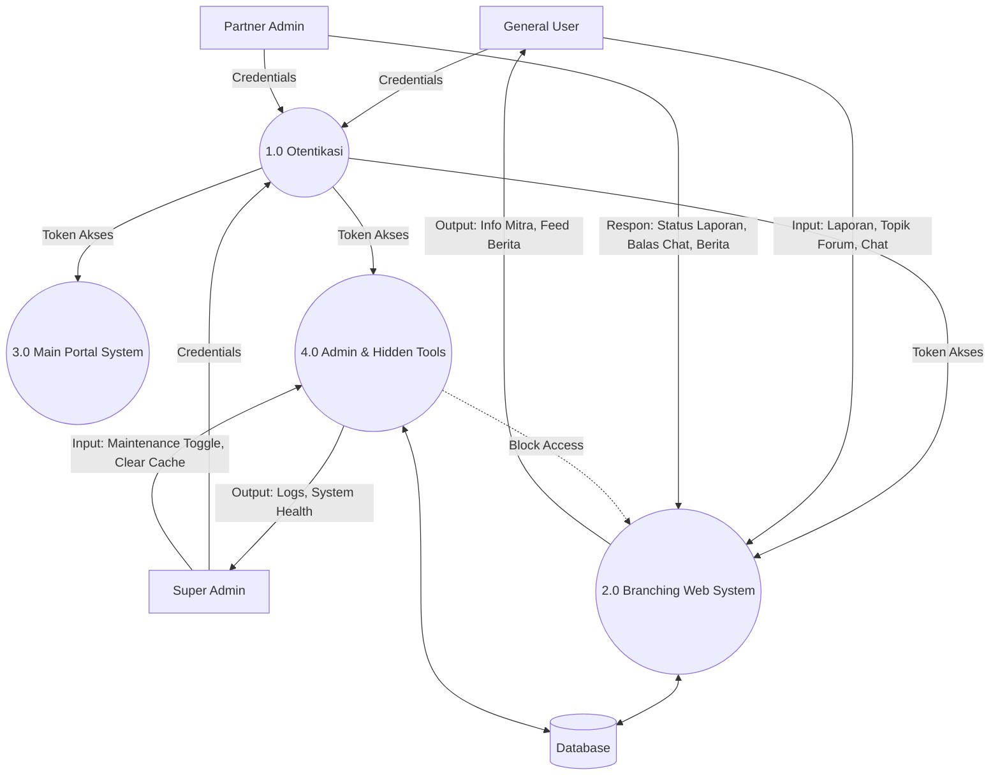
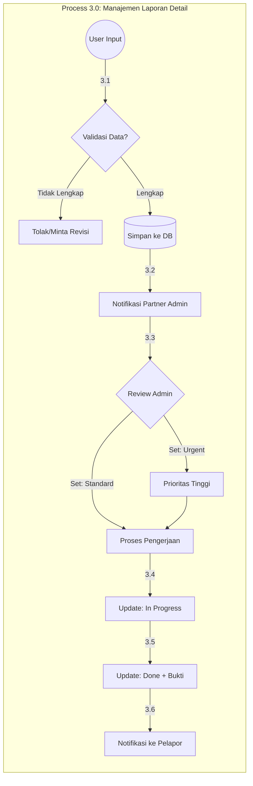
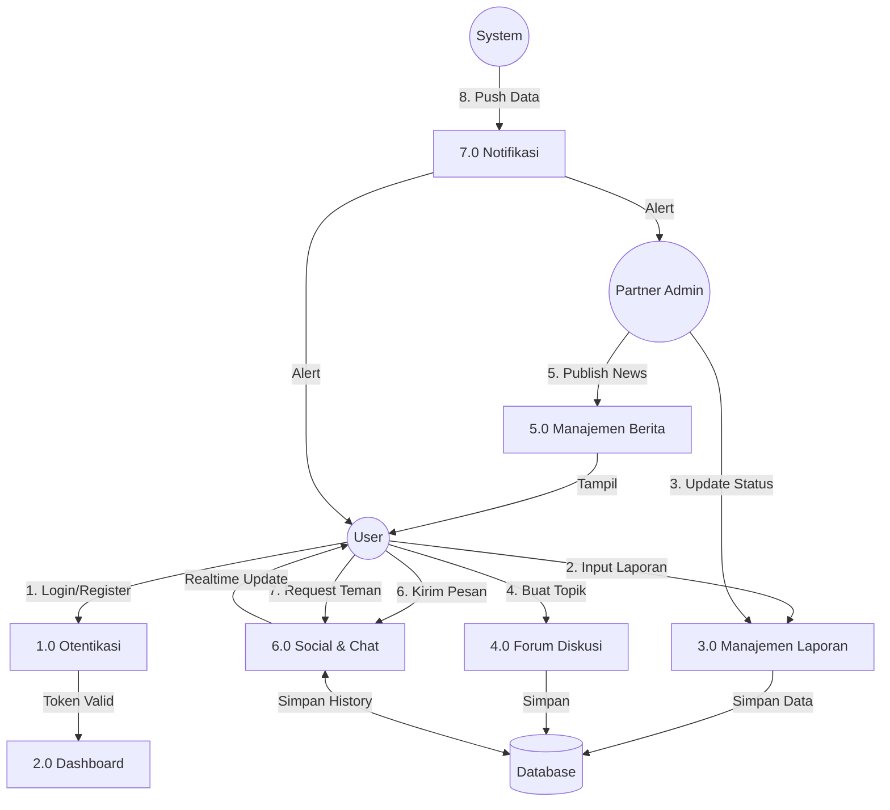
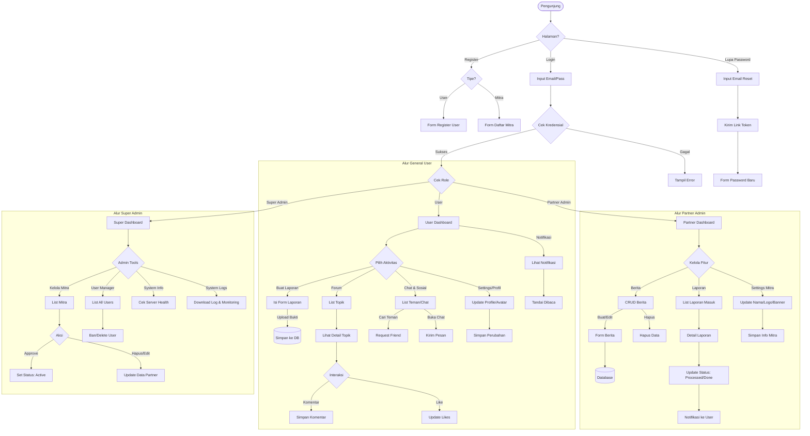

# Dokumentasi Lengkap Sistem SolveSphere

Dokumen ini adalah cetak biru (blueprint) lengkap dari sistem SolveSphere. Dokumen ini mencakup penjelasan arsitektur **Website Utama**, **Branching Web**, pembagian **3 Role User**, serta **Fitur Administratif/Tersembunyi**.

---

## 1. Konsep Utama: Multi-Tenant & Branching Web

Sistem ini unik karena memiliki dua "wajah" atau antarmuka utama yang saling terintegrasi namun memiliki fungsi berbeda.

1.  **Website Utama (Main Portal)**
    *   **URL**: `/` (Root), `/login`, `/dashboard` (Super Admin).
    *   **Fungsi**: Landing page global, pintu masuk otentikasi (Login/Register), dan pusat kontrol untuk Super Admin.
    *   **User Target**: Pengunjung umum, Calon Mitra, dan Super Admin.

2.  **Branching Website (Portal Mitra)**
    *   **URL**: `/partners/:slug` (Contoh: `/partners/pemkot-sby`, `/partners/komunitas-it`).
    *   **Fungsi**: Halaman khusus untuk setiap mitra yang bergabung. Memiliki data terisolasi (Berita, Forum, Laporan) yang hanya relevan dengan mitra tersebut.
    *   **User Target**: General User (Masyarakat/Anggota Komunitas) dan Partner Admin.

---

## 2. Detail 3 Role Pengguna

Hak akses dibagi secara ketat untuk menjaga keamanan dan privasi data antar mitra.

### A. Super Admin (Tuhan-nya Sistem)
Role tertinggi dengan akses tak terbatas.
*   **Akses**: Dashboard Super Admin (`/super-admin/*`).
*   **Fitur Utama**:
    *   **Manajemen Mitra**: Membuat, mengedit, atau men-suspend akun Mitra (Partner).
    *   **Manajemen User Global**: Melihat dan mengelola seluruh user terdaftar.
    *   **Global Settings**: Mengubah nama situs, deskripsi global.
*   **Fitur Tersembunyi / Advanced**:
    *   **Maintenance Mode**: Tombol "darurat" untuk mengunci akses website bagi user biasa saat perbaikan.
    *   **System Logs**: Mengunduh file log server (`laravel.log`) untuk debugging error.
    *   **Clear Cache**: Membersihkan cache aplikasi secara paksa.
    *   **System Info**: Melihat spesifikasi server (Versi PHP, OS, Kapasitas Disk, Database Driver).

### B. Partner Admin (Admin Cabang)
Administrator lokal yang bertanggung jawab atas satu halaman mitra.
*   **Akses**: Dashboard Partner Admin (`/partners/:slug/dashboard`).
*   **Batasan**: **Tidak bisa** melihat data mitra lain atau mengubah setting global.
*   **Fitur Utama**:
    *   **Kelola Berita**: Menulis dan menerbitkan berita untuk halamannya sendiri.
    *   **Moderasi Forum**: Menghapus topik diskusi yang tidak pantas di forummnya.
    *   **Manajemen Laporan**: Menerima laporan masuk, merubah status (`Processed`, `Completed`), dan memberi tanggapan.
    *   **Branding Mitra**: Mengubah logo, deskripsi, dan media sosial khusus untuk halaman mitranya.

### C. General User (Pengguna Umum)
Pengguna akhir (Masyarakat/Anggota) yang menggunakan layanan.
*   **Akses**: Halaman Publik (`/`) dan Halaman Mitra (`/partners/:slug/*`).
*   **Fitur**:
    *   **Multi-Site**: Bisa login sekali (SSO) dan mengunjungi berbagai halaman mitra berbeda.
    *   **Pelaporan**: Mengirim laporan masalah (dengan bukti foto) ke mitra tertentu.
    *   **Forum Diskusi**: Membuka topik baru, berkomentar, dan menyukai (like) diskusi.
    *   **Chat**: Mengirim pesan pribadi (*Direct Message*) ke Admin Mitra untuk konsultasi.

---

## 3. Fitur Tersembunyi & Keamanan

Fitur-fitur ini tidak terlihat oleh user biasa dan hanya muncul untuk level Admin tertentu atau situasi tertentu.

1.  **Maintenance Mode (Mode Perbaikan)**
    *   **Cara Kerja**: Ketika diaktifkan oleh Super Admin, Middleware `CheckMaintenanceMode` akan memblokir setiap request dari user biasa dengan pesan *503 Service Unavailable*.
    *   **Kecuali**: Super Admin tetap bisa login untuk melakukan perbaikan.

2.  **System Health Monitor**
    *   **Lokasi**: Menu Settings -> System Info.
    *   **Data**: Menampilkan beban disk, versi Laravel/PHP, dan status koneksi database secara real-time.

3.  **Log Viewer & Downloader**
    *   **Fungsi**: Super Admin dapat mengunduh file log kesalahan backend langsung dari browser tanpa perlu akses SSH ke server.

4.  **Auto-Redirect Context**
    *   **Logika**: Jika user sedang berada di halaman mitra A (`/partners/A`), lalu login atau mendaftar, sistem cerdas akan mengembalikan user tersebut ke halaman mitra A, bukan melempar ke halaman utama.


5.  **Mobile Responsiveness & UI**
    *   **Mobile Menu**: Navigasi khusus mobile dengan akses cepat ke Profil, Notifikasi, dan Link Legal (Footer).
    *   **Bottom Navigation**: Bar navigasi bawah untuk akses cepat ke fitur utama (Home, News, Forum, Reports).
    *   **Adaptive Layout**: Penyesuaian layout otomatis pada halaman kompleks seperti `AboutUs` (Card Stacking) dan Dashboard.

---

## 4. Diagram Alur Data (DFD) Komprehensif

Diagram ini menggambarkan aliran data antar entitas, termasuk fitur "Branching" dan "Hidden Features".

### Level 1: Interaksi Sistem Global



### Level 2: Detail Branching Web & Admin Tools

#### Diagram 2.1: Branching Logic
```mermaid
flowchart LR
    %% Sub-proses Branching
    subgraph "Branching Web Logic"
    GetSlug[Identifikasi Mitra via URL] --> LoadData[Load Data Mitra]
    LoadData --> Filter[Filter Konten (Forum/News) by Partner_ID]
    Filter --> Display[Tampilkan Halaman Mitra]
    end

    %% Sub-proses Hidden Admin
    subgraph "Hidden Admin Features"
    CheckMaint{Maintenance On?}
    CheckMaint -- Yes --> Block[Blokir User Biasa]
    CheckMaint -- No --> Allow[Izinkan Akses]
    
    ReqLog[Request Logs] --> ReadFile[Baca storage/logs]
    ReadFile --> Download[Download File]
    
    ReqCache[Clear Cache] --> Artisan[Run: php artisan optimize:clear]
    end
```

#### Diagram 2.2: Detail Proses Manajemen Laporan (Process 3.0)


---

## 5. ERD (Struktur Database) Lengkap

Diagram ini menunjukkan bagaimana data "Branching" difasilitasi oleh kolom `partner_id` di hampir semua tabel transaksi.

```mermaid
erDiagram
    %% --- MAIN TABLES (Business Logic) ---
    USERS {
        bigint id PK
        string name
        string email
        string password
        enum role "super_admin, partner_admin, general_user"
        string status "active, banned"
        string profile_picture
        foreign_key partner_id FK "Nullable"
        timestamp created_at
    }

    PARTNERS {
        bigint id PK
        string name
        string domain
        string slug
        string website
        text description
        string logo
        string banner
        enum status "active, pending"
        foreign_key user_id FK "Owner"
        timestamp created_at
    }

    REPORTS {
        bigint id PK
        string title
        text content
        string category
        string urgency
        string attachment
        string status "pending, in_progress, done"
        text admin_note
        foreign_key user_id FK
        foreign_key partner_id FK
        timestamp created_at
    }

    NEWS {
        bigint id PK
        string title
        text content
        string image
        timestamp published_at
        foreign_key admin_id FK
        foreign_key partner_id FK
        foreign_key report_id FK "Nullable"
        timestamp created_at
    }

    FORUM_TOPICS {
        bigint id PK
        string title
        text content
        string category
        boolean is_pinned
        string status
        foreign_key user_id FK
        foreign_key partner_id FK
        foreign_key best_answer_id FK
        timestamp created_at
    }

    FORUM_COMMENTS {
        bigint id PK
        text content
        foreign_key topic_id FK
        foreign_key user_id FK
        foreign_key parent_id FK
        timestamp created_at
    }

    MESSAGES {
        bigint id PK
        text message
        string attachment
        boolean is_read
        foreign_key sender_id FK
        foreign_key receiver_id FK
        timestamp created_at
    }

    NOTIFICATIONS {
        uuid id PK
        string type
        string notifiable_type
        bigint notifiable_id
        text data
        timestamp read_at
        timestamp created_at
    }

    FRIENDS {
        bigint id PK
        enum status "pending, accepted, rejected"
        foreign_key user_id FK
        foreign_key friend_id FK
        timestamp created_at
    }

    SUBSCRIPTIONS {
        bigint id PK
        enum status "pending, active, rejected, expired"
        string proof_image
        timestamp start_date
        timestamp end_date
        foreign_key partner_id FK
        timestamp created_at
    }

    PARTNER_RATINGS {
        bigint id PK
        integer rating
        text comment
        foreign_key user_id FK
        foreign_key partner_id FK
        timestamp created_at
    }

    SETTINGS {
        bigint id PK
        string key
        text value
        string group
    }

    %% --- INTERACTION & SYSTEM TABLES ---
    NEWS_LIKES {
        bigint id PK
        foreign_key user_id FK
        foreign_key news_id FK
        timestamp created_at
    }

    FORUM_TOPIC_LIKES {
        bigint id PK
        enum type "like, dislike"
        foreign_key user_id FK
        foreign_key forum_topic_id FK
        timestamp created_at
    }

    COMMENT_LIKES {
        bigint id PK
        foreign_key user_id FK
        foreign_key comment_id FK
        timestamp created_at
    }

    PASSWORD_RESET_TOKENS {
        string email PK
        string token
        timestamp created_at
    }

    SESSIONS {
        string id PK
        foreign_key user_id FK
        string ip_address
        string user_agent
        longtext payload
        integer last_activity
    }

    CACHE {
        string key PK
        mediumtext value
        integer expiration
    }

    CACHE_LOCKS {
        string key PK
        string owner
        integer expiration
    }

    JOBS {
        bigint id PK
        string queue
        longtext payload
        unsignedTinyInteger attempts
        unsignedInteger reserved_at
        unsignedInteger available_at
        unsignedInteger created_at
    }

    JOB_BATCHES {
        string id PK
        string name
        integer total_jobs
        integer pending_jobs
        integer failed_jobs
        longtext failed_job_ids
    }

    FAILED_JOBS {
        bigint id PK
        string uuid
        text connection
        text queue
        longtext payload
        longtext exception
        timestamp failed_at
    }

    PERSONAL_ACCESS_TOKENS {
        bigint id PK
        %% --- RELATIONSHIPS ---
    USERS ||--o{ REPORTS : "has (user_id)"
    USERS ||--o{ FORUM_TOPICS : "creates (user_id)"
    USERS ||--o{ FORUM_COMMENTS : "writes (user_id)"
    USERS ||--o{ MESSAGES : "sends (sender_id)"
    USERS ||--o{ MESSAGES : "receives (receiver_id)"
    USERS ||--o{ PARTNER_RATINGS : "rates (user_id)"
    USERS ||--o{ NEWS_LIKES : "likes (user_id)"
    USERS ||--o{ FORUM_TOPIC_LIKES : "likes (user_id)"
    USERS ||--o{ COMMENT_LIKES : "likes (user_id)"
    USERS ||--|{ PARTNERS : "owns (user_id)"
    
    PARTNERS ||--o{ REPORTS : "receives (partner_id)"
    PARTNERS ||--o{ NEWS : "publishes (partner_id)"
    PARTNERS ||--o{ FORUM_TOPICS : "hosts (partner_id)"
    PARTNERS ||--o{ SUBSCRIPTIONS : "offers (partner_id)"
    
    FORUM_TOPICS ||--o{ FORUM_COMMENTS : "contains (topic_id)"
    FORUM_TOPICS ||--o{ FORUM_TOPIC_LIKES : "has (forum_topic_id)"
    FORUM_COMMENTS ||--o{ COMMENT_LIKES : "has (comment_id)"
    NEWS ||--o{ NEWS_LIKES : "has (news_id)"
    }

    %% Table Definitions
    USERS {
        bigint id PK
        string name
        string email
        string role "super_admin, partner_admin, user"
        string status "active, banned"
        foreign_key partner_id "Nullable"
    }

    PARTNERS {
        bigint id PK
        string name
        string slug "Unique URL Identifier"
        string domain
        text description
        string logo
        string banner
        string status "active, pending"
        foreign_key user_id "Owner"
    }

    REPORTS {
        bigint id PK
        string title
        text content
        string status "pending, in_progress, done"
        string urgency
        foreign_key user_id
        foreign_key partner_id
        string attachment
        string status "pending, in_progress, done"
        text admin_note
        foreign_key user_id FK
        foreign_key partner_id FK
        timestamp created_at
    }

    NEWS {
        bigint id PK
        string title
        text content
        string image
        timestamp published_at
        foreign_key admin_id FK
        foreign_key partner_id FK
        foreign_key report_id FK "Nullable"
        timestamp created_at
    }

    FORUM_TOPICS {
        bigint id PK
        string title
        text content
        string category
        boolean is_pinned
        string status
        foreign_key user_id FK
        foreign_key partner_id FK
        foreign_key best_answer_id FK
        timestamp created_at
    }

    FORUM_COMMENTS {
        bigint id PK
        text content
        foreign_key topic_id FK
        foreign_key user_id FK
        foreign_key parent_id FK "Recursive"
        timestamp created_at
    }

    MESSAGES {
        bigint id PK
        text message
        string attachment
        boolean is_read
        foreign_key sender_id FK
        foreign_key receiver_id FK
        timestamp created_at
    }

    NOTIFICATIONS {
        uuid id PK
        string type
        string notifiable_type
        bigint notifiable_id
        text data
        timestamp read_at
        timestamp created_at
    }

    FRIENDS {
        bigint id PK
        string status "pending, accepted, rejected"
        foreign_key user_id FK
        foreign_key friend_id FK
        timestamp created_at
    }

    SUBSCRIPTIONS {
        bigint id PK
        string status "pending, active, rejected, expired"
        string proof_image
        timestamp start_date
        timestamp end_date
        foreign_key partner_id FK
        timestamp created_at
    }

    PARTNER_RATINGS {
        bigint id PK
        integer rating
        text comment
        foreign_key user_id FK
        foreign_key partner_id FK
        timestamp created_at
    }

    SETTINGS {
        bigint id PK
        string key
        text value
        string group
    }

    %% --- RELATIONSHIPS (Simplified) ---
    USERS ||--o{ REPORTS : "1-N"
    PARTNERS ||--o{ REPORTS : "1-N"
    USERS ||--o{ NEWS : "1-N (Admin)"
    PARTNERS ||--o{ FORUM_TOPICS : "1-N"
```

### Detail Skema Database (Kamus Data)

Berikut adalah rincian struktur tabel dan relasinya dalam format tabular untuk kejelasan teknis.

#### 1. Tabel Utama

| Nama Tabel | Deskripsi | Kolom Penting | Relasi Utama |
| :--- | :--- | :--- | :--- |
| **users** | Menyimpan data seluruh pengguna (Admin & User). | `id`, `name`, `email`, `password`, `role` (enum: super_admin, partner_admin, user), `image` | `has_many` Reports, Forum Topics, Comments. |
| **partners** | Menyimpan profil Mitra/Cabang. | `id`, `name`, `slug` (URL), `status` (active/suspend), `domain`, `style_config` | `has_many` Users (members), Reports, News. |
| **settings** | Konfigurasi dinamis sistem (Fitur Tersembunyi). | `key` (misal: maintenance_mode), `value`, `group` | - |

#### 2. Tabel Fitur (Branching Content)

Semua tabel ini memiliki kolom `partner_id` sebagai pembeda data antar mitra (Multi-tenant).

| Nama Tabel | Deskripsi | Kolom Penting | Foreign Keys (Relasi) |
| :--- | :--- | :--- | :--- |
| **reports** | Laporan pengaduan dari user. | `title`, `content`, `image`, `status` (pending/processed/completed), `location` | `user_id` -> users.id<br>`partner_id` -> partners.id |
| **news** | Berita yang ditulis admin mitra. | `title`, `slug`, `content`, `image`, `status` (draft/published) | `partner_id` -> partners.id |
| **forum_topics** | Topik diskusi komunitas. | `title`, `content`, `category`, `views` | `user_id` -> users.id<br>`partner_id` -> partners.id |
| **forum_comments** | Balasan di topik forum. | `content`, `parent_id` (untuk reply in thread) | `user_id`, `topic_id` |
| **chat_messages** | Pesan chat real-time. | `content`, `is_read`, `type` (text/image) | `sender_id`, `receiver_id`, `partner_id` |

#### 3. Tabel Pendukung

| Nama Tabel | Deskripsi | Relasi |
| :--- | :--- | :--- |
| **report_comments** | Diskusi spesifik pada sebuah laporan (tindak lanjut). | `report_id`, `user_id` |
| **likes** | Menyimpan data like user pada topik/komentar. | `user_id`, `likeable_id`, `likeable_type` (Polymorphic) |
| **notifications** | Notifikasi user/admin. | `user_id`,
### A. Entity Relationship Diagram (ERD) - 30+ Tabels

```mermaid
erDiagram
    %% --- RELATIONSHIPS ---
    USERS ||--o{ REPORTS : "has (user_id)"
    USERS ||--o{ FORUM_TOPICS : "creates (user_id)"
    USERS ||--o{ FORUM_COMMENTS : "writes (user_id)"
    USERS ||--o{ MESSAGES : "sends (sender_id)"
    USERS ||--o{ MESSAGES : "receives (receiver_id)"
    USERS ||--o{ PARTNER_RATINGS : "rates (user_id)"
    USERS ||--o{ NEWS_LIKES : "likes (user_id)"
    USERS ||--o{ FORUM_TOPIC_LIKES : "likes (user_id)"
    USERS ||--o{ COMMENT_LIKES : "likes (user_id)"
    USERS ||--|{ PARTNERS : "owns (user_id)"
    USERS ||--o{ FRIENDS : "requests (user_id)"
    USERS ||--o{ FRIENDS : "accepts (friend_id)"
    USERS ||--o{ NOTIFICATIONS : "receives (notifiable_id)"
    
    PARTNERS ||--o{ REPORTS : "receives (partner_id)"
    PARTNERS ||--o{ NEWS : "publishes (partner_id)"
    PARTNERS ||--o{ FORUM_TOPICS : "hosts (partner_id)"
    PARTNERS ||--o{ SUBSCRIPTIONS : "offers (partner_id)"
    
    FORUM_TOPICS ||--o{ FORUM_COMMENTS : "contains (topic_id)"
    FORUM_TOPICS ||--o{ FORUM_TOPIC_LIKES : "has (forum_topic_id)"
    FORUM_COMMENTS ||--o{ COMMENT_LIKES : "has (comment_id)"
    NEWS ||--o{ NEWS_LIKES : "has (news_id)"

    %% --- SYSTEM TABLES (No Direct Relations) ---
    FRIENDS { bigint id, foreign_key user_id, foreign_key friend_id, enum status }
    SETTINGS { bigint id, string key, text value, string group }
    NOTIFICATIONS { uuid id, string type, text data, timestamp read_at }
    JOBS { bigint id, string queue, longtext payload }
    CACHE { string key, mediumtext value, int expiration }
```

### B. Data Flow Diagram (DFD) Level 0 & 1



### C. Flowchart Sistem (User Journey)


